# 图查询Cypher实践：基于微服务监测数据的异常分析建模及应用

> **实验相关的代码和数据在`${PROJECT_ROOT}/labs/tugraph/cypher`中**

## 简介

本文档详细介绍了根因分析模型的研究背景、模型构建、数据导入和查询任务，读者可根据此文档建立对基于TuGraph的根因分析模型的认识，并根据对应文件尝试构建该模型。

随着微服务应用规模的不断增长，微服务系统异常类型越发繁多，保障大规模微服务系统的稳定性变得至关重要。一旦某个服务实例出现故障，异常状态可能会迅速在相邻的服务实例之间扩散，从而对整个微服务系统的稳定性造成影响。因此，对系统异常和用户反馈的有效检测与定位，对于开发人员快速识别和解决问题，缩短系统故障时间，以及增强系统整体稳定性至关重要。

## 模型介绍

微服务系统的监测数据主要包括日志（log）、踪迹（trace）和度量（metric）。因此，每个事务包含以上三种监测类型的数据。日志：以半结构化的文本形式记录服务流程和交互信息，包括关键时间点、流程详情和阶段结果。踪迹：以树状结构详细记录事务调用的序列、状态和结果，确保操作的可追溯性和完整性。度量数据：以时间序列形式记录系统性能和硬件状态的关键指标，如CPU、磁盘和内存使用情况。

模型包含了每个事务所对应的异常根因、该事务日志记录的特征向量、该事务踪迹记录的特征向量、该事务度量记录的特征向量，分别对应的不同的节点。

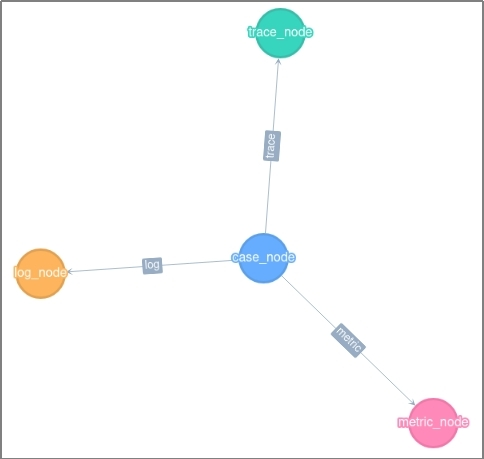

模型结构如上图所示，模型节点标签说明如下表所示。

表1

| 标签           | 类型 | 说明                                 |
|----------------|------|--------------------------------------|
| case_node      | 节点 | 表示某一事务                         |
| trace_node     | 节点 | 表示某一事务的踪迹监测数据           |
| log_node       | 节点 | 表示某一事务的日志监测数据           |
| metric_node    | 节点 | 表示某一事务的度量监测数据           |
| id             | 实体 | 作为主键在TuGraph中标识一个事务      |
| case_id        | 实体 | 微服务中唯一表示一个事务的统一标识符 |
| trace_feature  | 实体 | 表示该事务所有踪迹数据的特征向量     |
| log_feature    | 实体 | 表示该事务所有日志数据的特征向量     |
| metric_feature | 实体 | 表示该事务所有度量数据的特征向量     |
| trace          | 关系 | 表示连接当前事务和对应踪迹节点       |
| log            | 关系 | 表示连接当前事务和对应日志节点       |
| metric         | 关系 | 表示连接当前事务和对应度量节点       |

## 导入模型

在安装好TuGraph并运行后，可以通过浏览器访问模型导入界面微服务根因分析模型 [http://localhost:7070/#/Workbench/CreateLabel](http://localhost:7070/#/Workbench/CreateLabel )。模型结构信息存放于文件Root_Cause_Analysis_schema.json。

（1）建立子图，点击最上方导航栏中的“新建子图”，然后填写子图信息，最后点击“创建”，完成根因分析子图创建，具体步骤如下图所示。

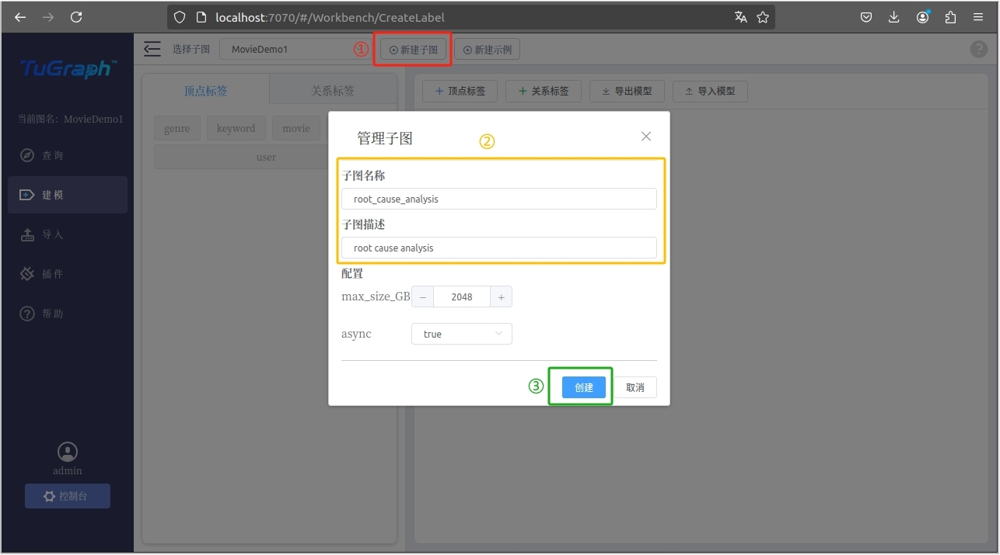

（2）导入模型。首先切换到刚才新建的根因分析子图，接着点击左侧导航栏中的“建模”，接着选择右上方的“导入模型”，选择文件夹中的Root_Cause_Analysis_schema.json，最后点击“导入”完成模型导入，具体步骤如下图所示。

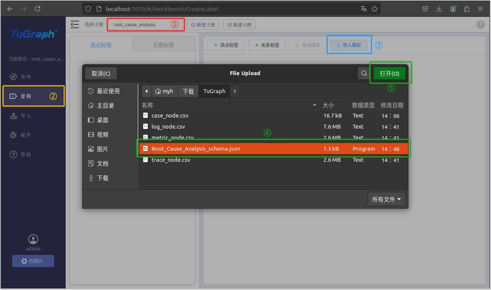

导入成功后显示如下图所示，包含四个顶点标签和三个关系标签。

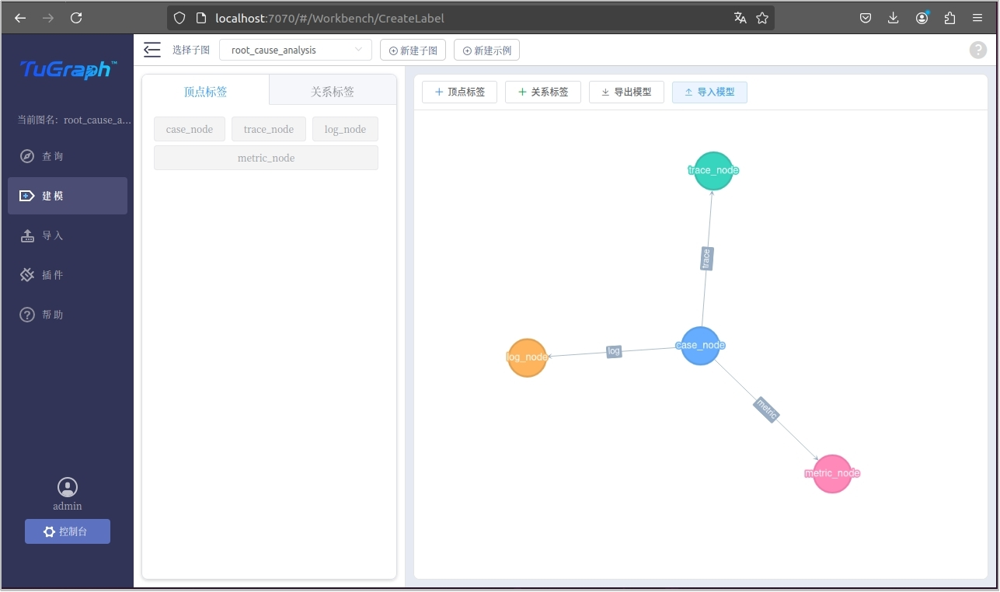

## 导入数据

依据所有节点和关系，依次导入监测数据。首先点击左侧导航栏的“导入”，接着点击屏幕中央的“选择文件”，具体步骤如下图所示。

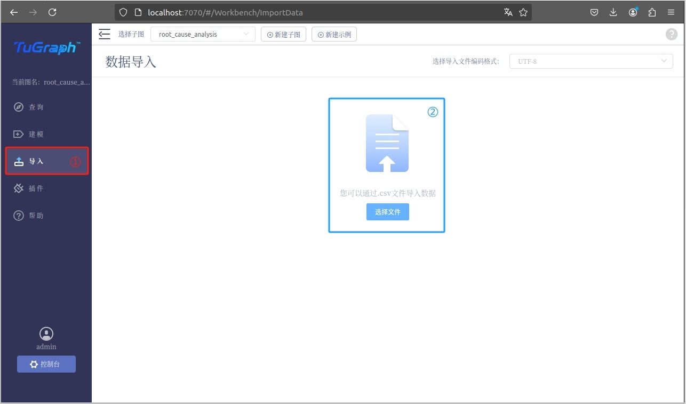

（1）导入case_node节点数据，对应的文件为case_node.csv。首先在弹出的文件夹中选择case_node.csv，接着点击右上角“打开”，如下图所示。

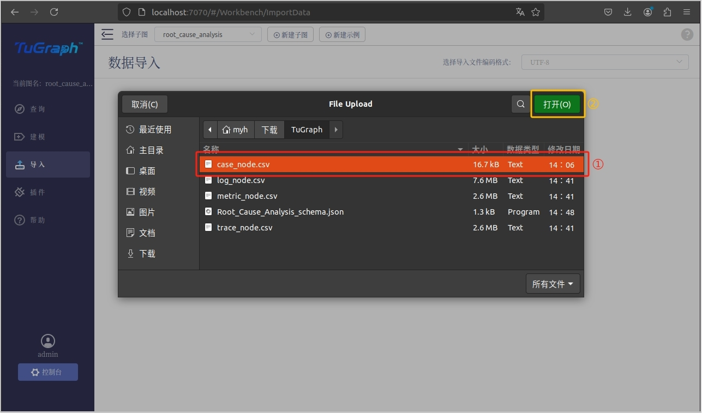

接着在选择标签处，分别选择“点”和“case_noce”，分别如下图所示。

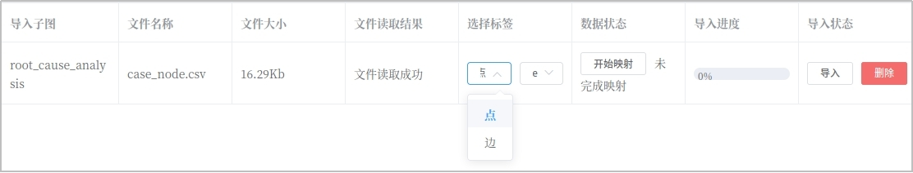

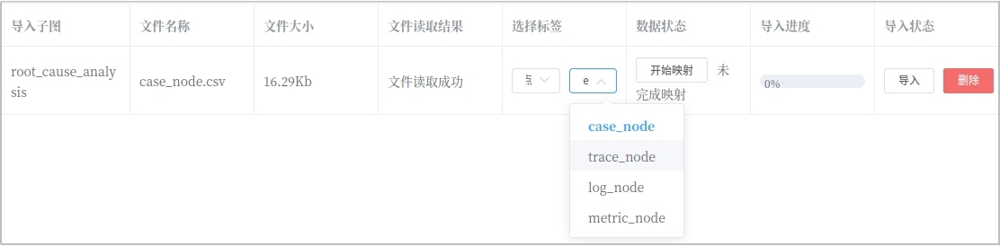

接着映射数据状态，选择从第2行开始导入，每一列对应文件标签和节点标签一一对应，最后点击“映射”，如下图所示。

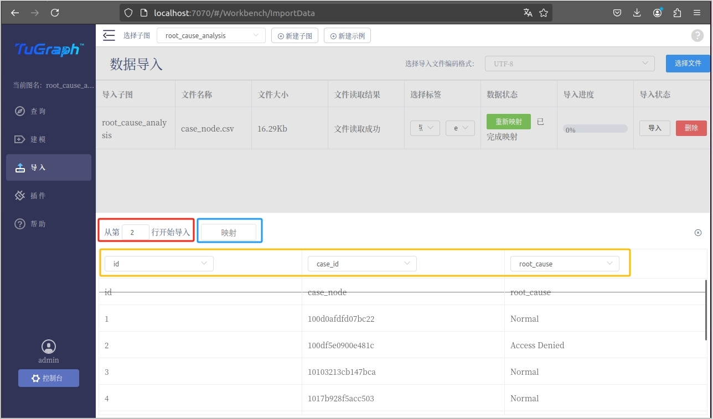

最后，点击“导入”，待导入进入变为100%后即为导入成功如下图所示。

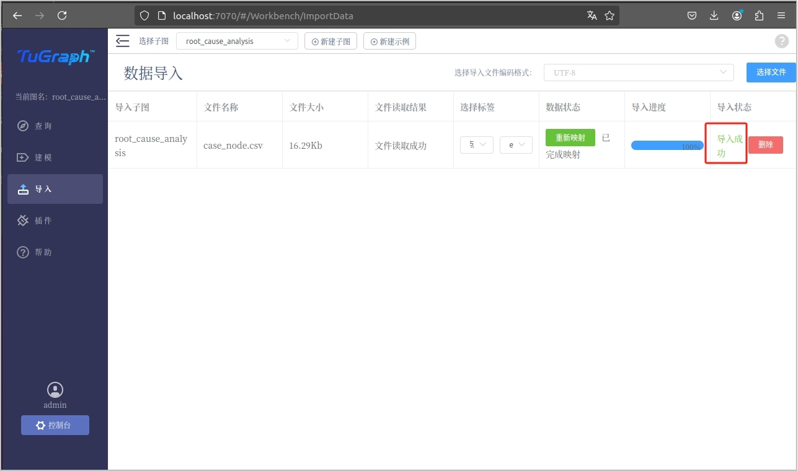

（2）导入trace_node、log_node和metric_node节点数据，对应的文件分别为trace_node.csv、log_node.csv和metric_node.csv。分别重复上述导入case_node节点数据的操作，分别导入trace_node、log_node和metric_node节点数据，标签选择“点”和对应的节点名称，均从第二行开始映射，每一列对应文件标签和节点标签一一对应。导入成功后如下图所示。

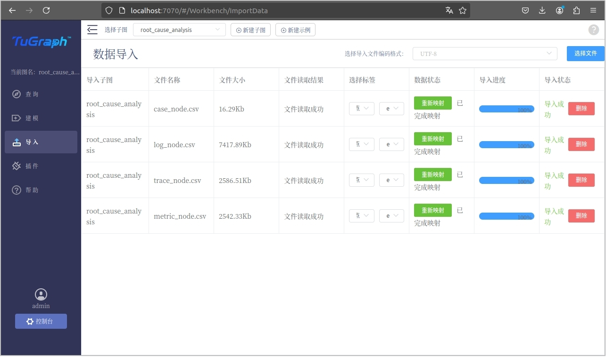

（3）导入边。分别为每个事务导入log、trace和metric的边信息。由于case_node的主键为id，trace_node、log_node和metric_node的主键为case_id，因此，可以使用case_node.csv完成边信息导入。选择文件时依旧选择case_node.csv，标签选择“边”和对应的边名称，如下图所示。接着映射数据状态，选择从第2行开始导入，起点选择case_node，终点选择对应的节点，如下图所示。然后点击映射，并完成导入，如下图所示。接着重复上述操作，完成对剩余边数据的导入，最后结果如下图所示。

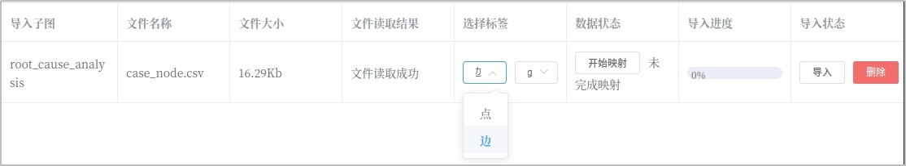

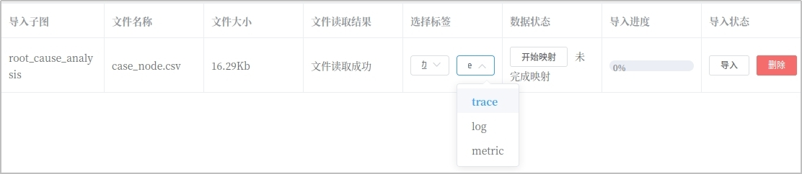

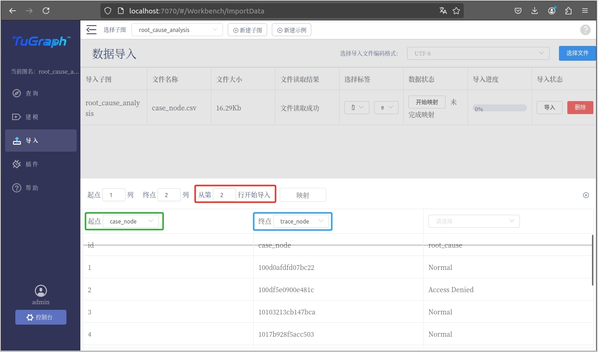

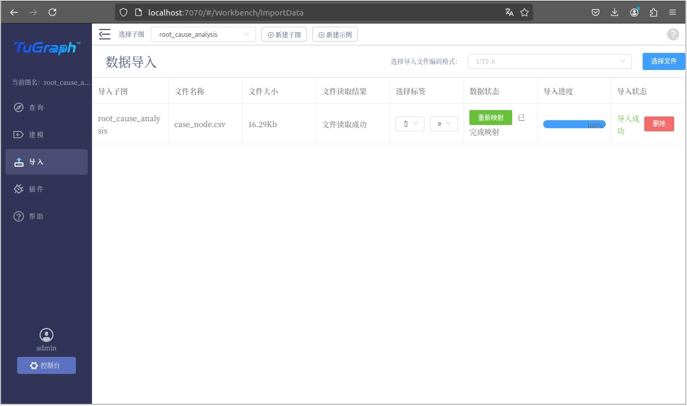

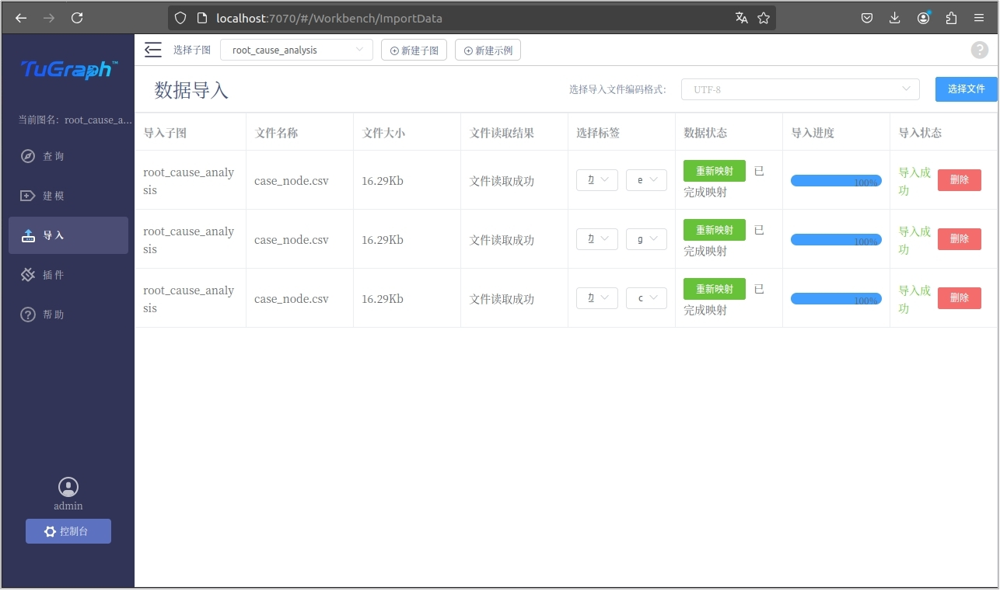

## 查询实例

按照上述步骤完成模型导入和数据导入后，可使用 MATCH (n) RETURN n LIMIT 10测试导入结果，可以看到页面展示了是个case_node，对当个case_node点击“一级展开”可以看到对应的trace_node、log_node和metric_node，如下图所示。读者可在构建完成后尝试完成下面几个任务。

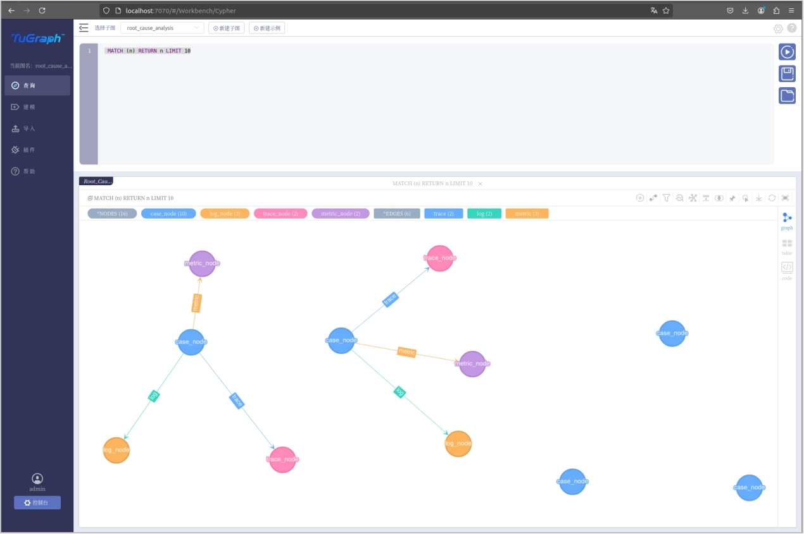

### 查询任务一

查询case_id为“10103213cb147bca”的trace节点。结果如下图所示。正确查询语句如下：

``` cypher
MATCH (n)-[e:trace]-(m) where n.case_id='10103213cb147bca' RETURN n
```

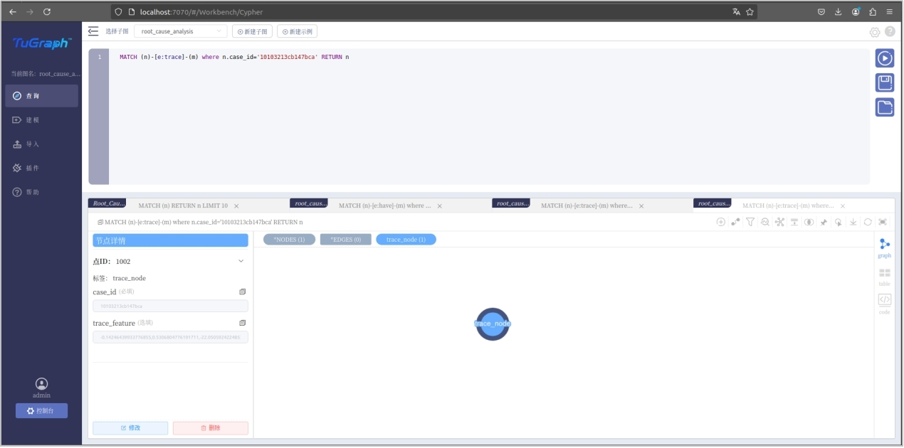

### 查询任务二

查询case_id为“10103213cb147bca”的所有节点。查询结果如下图所示，正确查询语句如下：

``` cypher
MATCH (n)-[e]-(m) where n.case_id='10103213cb147bca' RETURN n , m
```

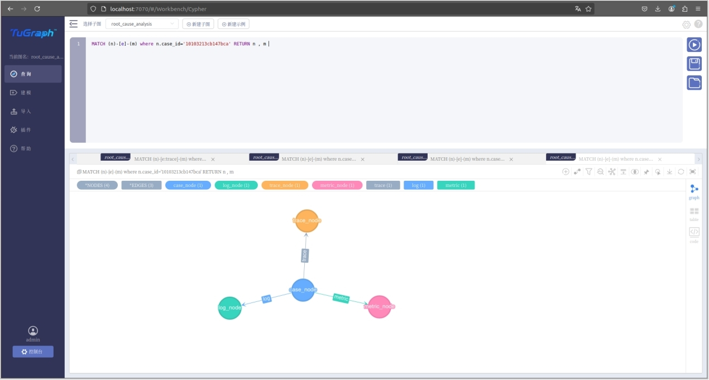

### 查询任务三

查询所有正常事务的case_node、trace_node、log_node和metric_node节点。查询结果如下图所示，正确查询语句如下：

``` cypher
MATCH (n)-[e]-(m) where n.root_cause='Normal' RETURN n,m
```

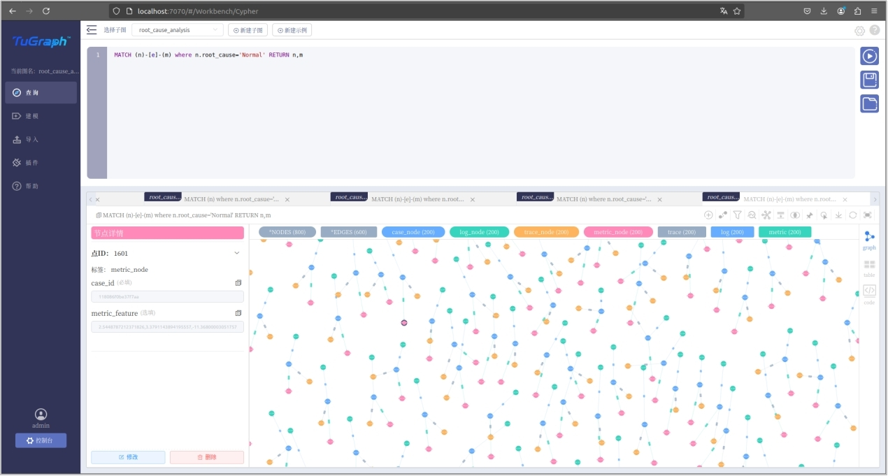

### 查询任务四

查询所有根因为文件异常的事务的trace_node。查询结果如下图所示，正确查询语句如下：

``` cypher
MATCH (n)-[e:trace]-(m) where n.root_cause='File Missing' RETURN m
```

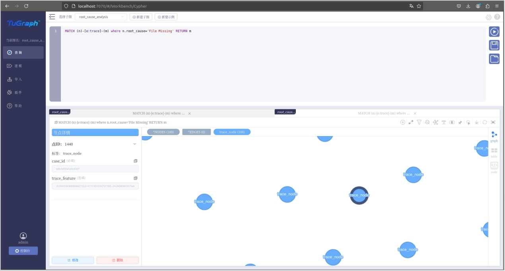