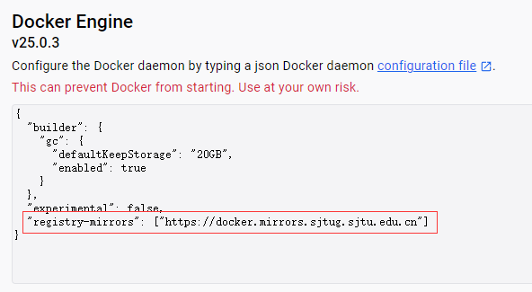
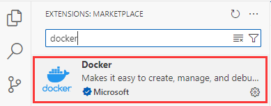
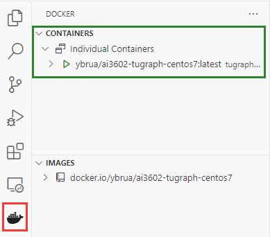
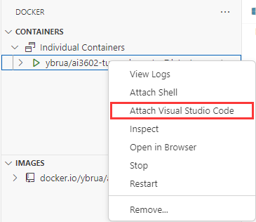
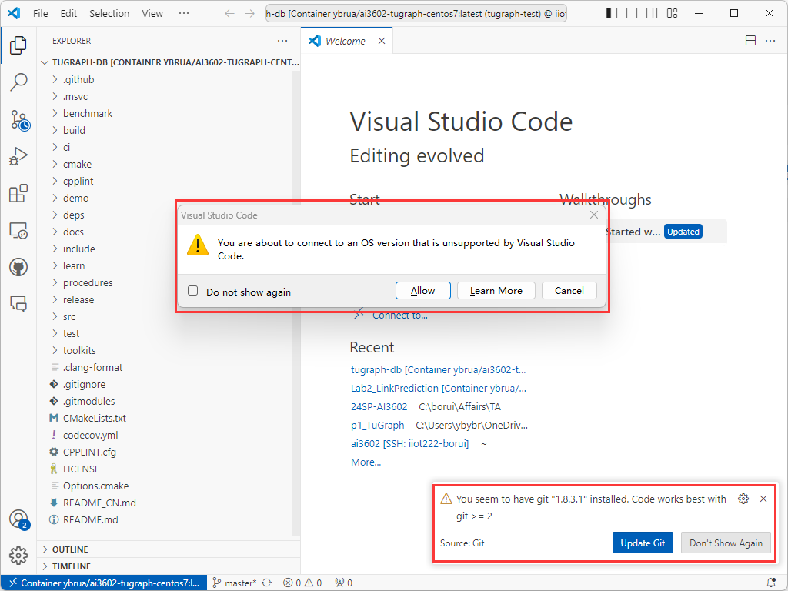
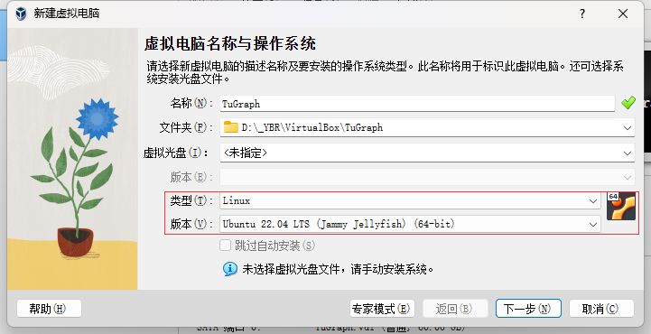
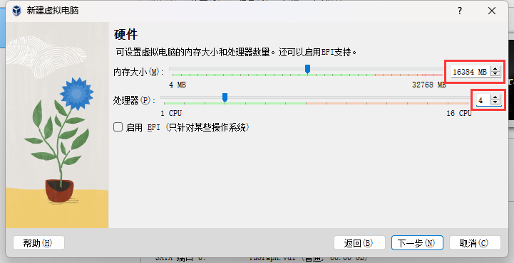
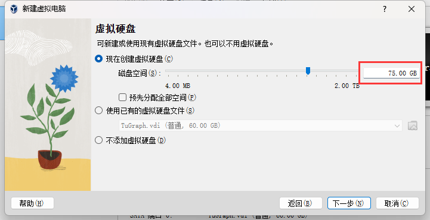
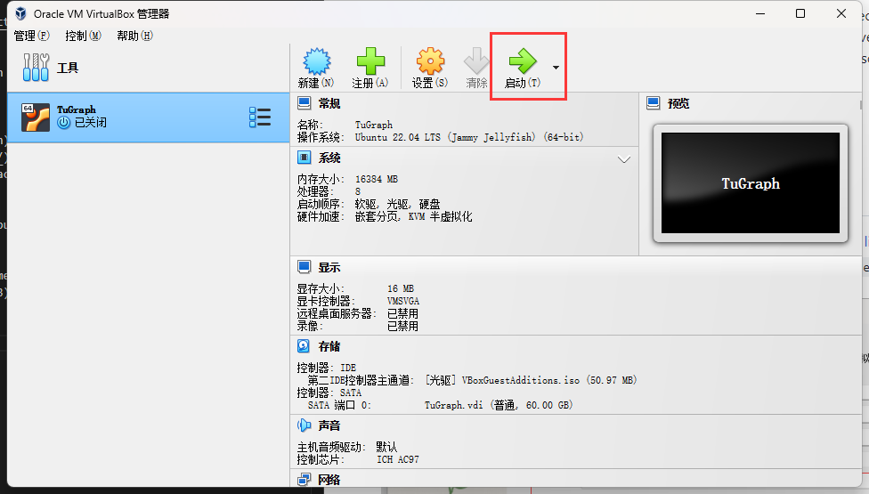

# Lab 0 实验前准备

> **实验相关的代码和数据在`${PROJECT_ROOT}/labs/tugraph/lab0`中**

## 简介

本实验将围绕图数据结构上的数据挖掘算法展开，我们将使用 [TuGraph-DB](https://github.com/TuGraph-family/tugraph-db)作为支持基础设施。TuGraph-DB 提供了用于查询和更新图数据库的事务型图数据库引擎，并内置了高效分析图数据的算法。

TuGraph-DB 目前支持 C++ 和 Python 接口，而本实验将主要使用 Python API。Lab 0是一个**教程**，旨在帮助你了解如何搭建实验环境并进行开发，以便你能为之后的实验做好准备。

## 1 准备 Docker 容器

推荐通过 [Docker](https://www.docker.com/) 来部署 TuGraph。

1. 如果你有可以使用 Docker 的 Linux 服务器，可以直接使用。
2. Windows 和 MacOS 用户可以考虑安装 [Docker Desktop](https://www.docker.com/products/docker-desktop)。
   - **注意：** Windows 用户可能需要先[启用 Hyper-V](https://learn.microsoft.com/zh-cn/virtualization/hyper-v-on-windows/quick-start/enable-hyper-v) 才能让 Docker Desktop 正常运行。如果遇到问题，可以参考 [这篇 Stack Overflow 帖子](https://stackoverflow.com/questions/39684974/docker-for-windows-error-hardware-assisted-virtualization-and-data-execution-p)。
3. 如果以上方法都无法使用，最后可以尝试在 Linux 虚拟机（例如 VirtualBox 下的 Ubuntu）中安装 Docker 再使用镜像。
   - **注意：**这种方法不推荐，仅在其他方法都失败时使用。分配给虚拟机的资源最好不少于 4 核 CPU、8GB 内存和 50GB 磁盘。
   - 如果你需要使用虚拟机，请参考附录三中关于虚拟机的指引。

### 1.1 拉取镜像

TuGraph 使用 C++ 开发，使用前必须先编译。为方便大家部署，我们提前准备了一个已编译好的 TuGraph 数据库并安装了 conda 环境的 Docker 镜像，镜像名为 `ybrua/ai3602-tugraph-centos7`，可在 Docker Hub 获取：

```sh
# 注意：Docker Desktop 用户需先启动 Docker Desktop 再执行此命令
docker pull ybrua/ai3602-tugraph-centos7:latest
```

⚠️ **注意：** 该镜像大小约为 **25GB**，请确保你的磁盘空间足够。

如果从 Docker Hub 拉取失败，可参考 [SJTUG 官方文档](https://mirrors.sjtug.sjtu.edu.cn/docs/docker-registry) 设置加速镜像，Docker Desktop 用户可在 `Settings -> Docker Engine` 添加：  

```json
"registry-mirrors": ["https://docker.mirrors.sjtug.sjtu.edu.cn"]
```

  

应用更改并重启 Docker Desktop。

### 1.2 启动容器

镜像拉取成功后，用以下命令启动容器：

```sh
docker run -it -d -p 7070:7070 -v C:/somewhere:/root/ai3602 --name tugraph-ai3602 ybrua/ai3602-tugraph-centos7:latest /bin/bash
```

- `-v src:dst` 用于挂载存储到容器，如 `C:/somewhere:/root/ai3602` 会让你在容器的 `/root/ai3602` 看到本机 `C:/somewhere` 的文件。
- `--name tugraph-ai3602` 是容器名，启动后可用该名字引用容器。

该命令会以后台模式启动容器，可用 `docker ps` 查看：

```sh
CONTAINER ID   IMAGE                                 COMMAND       CREATED       STATUS       PORTS                                       NAMES
f4e84a948524   ybrua/ai3602-tugraph-centos7:latest   "/bin/bash"   4 hours ago   Up 4 hours   0.0.0.0:7070->7070/tcp, :::7070->7070/tcp   tugraph-ai3602
```


### 1.3 进入容器

```sh
docker exec -it tugraph-ai3602 bash
```

即可进入容器终端。

### 1.4 其他 Docker 命令

- 停容器：`docker stop tugraph-ai3602`
- 启动已经停止的容器：`docker start tugraph-ai3602`
- 删除容器（需停止后才能删）： `docker rm tugraph-ai3602`  

⚠️ 删除容器会丢失所有数据，请至少保留到实验完成。


### 1.5 额外提示

- 镜像已在 Ubuntu 20.04、Windows 11 Docker Desktop（WSL2）、Ubuntu 22.04 VirtualBox VM 测试通过。
- 推荐在容器中用 **Visual Studio Code** 开发（见附录一）。
- 想在容器提示符显示当前目录，可在 `/root/.bashrc` 加`PS1='$(whoami)@$(hostname):$(pwd)# '`，并 `source .bashrc`。


## 2 创建 Python 3.6 环境

TuGraph 编译时绑定了 Python 3.6，必须使用该版本才能运行。

示例（容器内已安装 Miniconda）：

```sh
conda create -n tugraph -y Python=3.6
conda activate tugraph
```


## 3 导入数据到 TuGraph DB

> 已编译的 TuGraph 可执行文件在 `tugraph-db/build/outputs/`。

先用 `lgraph_import` 工具导入数据。示例数据在 `tugraph-db/test/integration/data/algo`，我们用 `fb` 图为例，需三个文件：（1）配置 `*.conf`，（2）边文件，（3）点文件。


## 4 运行内置加权 PageRank

TuGraph 内置算法在 `tugraph-db/procedures/algo_cpp/`，编译并运行：

```sh
cd /root/tugraph-db/build
make wpagerank_embed
cd output
./algo/wpagerank_embed ./fb_db
```

会输出 JSON 格式的运行结果。


## 5 使用 TuGraph API 编写 Python 程序

文档见官方链接或附录四。我们提供了测试程序 `p1_main.py` + `bfs.py`。

**导入样例数据：**

```sh
cd /root/tugraph-db/build/output
cp -r /root/ai3602/p1_TuGraph/p1_data/ ./
./lgraph_import -c ./p1_data/p1.conf --dir ./p1_db --graph default --overwrite 1
```

**运行样例程序：**

```sh
conda activate tugraph
python p1_main.py
```


## 附录

### 附录一：使用 Visual Studio Code 进行 Docker 开发

推荐使用 Visual Studio Code 来操作 Docker 容器。

首先，在插件市场中安装 **Docker 插件**。



安装完成后，你应该能在 VS Code 的侧边栏（Panel）中看到一个 **Docker 图标**（红色标记处）。



**容器面板**（绿色标记处）会显示当前所有的 Docker 容器。注意，这里我们基于镜像 `ai3602-tugraph-centos7` 运行的一个容器已经在运行中。

右键点击该容器，选择 **`Attach Visual Studio Code`**（附加到 VS Code）。



这会打开一个新的 VS Code 窗口。



此时，VS Code 可能会提示 **CentOS 7 操作系统版本不受支持**——这是正常的，直接点击 **Allow（允许）** 忽略即可。

在右下角，你可能还会看到另一条 **Git 可以更新** 的提示，也可以忽略。

一切准备就绪后，你就可以在 VS Code 中访问容器内的文件了。可以像在本地 PC 一样打开文件夹、浏览文件、编写代码。  
不过需要注意，你可能需要在**容器内的 VS Code**中手动安装一些额外插件（例如 Python 插件）。

### 附录二：从零开始构建 TuGraph Docker 容器

如果可能的话，建议你优先使用已经提供好的 docker 镜像。  
但是，如果该镜像运行不正常，你可以尝试按照下述说明自己构建镜像。  

需要注意的是，构建这样的镜像需要**从源码编译** TuGraph。编译过程需要较多内存，而且可能需要 15–30 分钟（取决于你的设备）。**因此，如果必须自己构建镜像，请务必在计算资源充足、最好是服务器的机器上进行。**

你可以选择：
- [直接用 Dockerfile 编译镜像](#1-从dockerfile编译镜像)，或者
- 按 TuGraph 仓库的说明 [从零编译 TuGraph](#2-从零编译tugraph)。

#### 1. 从 Dockerfile 编译镜像

本作业中已经提供了 `Dockerfile`，它与助教用于构建 `ybrua/ai3602-tugraph-centos7` 镜像的文件完全一致。你可以用这个 Dockerfile 构建新镜像，命令如下：

```sh
docker build -t ybrua/ai3602-tugraph-centos7:latest -t ybrua/ai3602-tugraph-centos7:1.0.0 .
```

**注意：** 构建过程包含 TuGraph 的编译。如果编译过程突然出错，通常是因为内存不足。你可以考虑减少 Dockerfile 中的 `-j20` 参数，比如：

```dockerfile
# Dockerfile 的第 8 行到第 14 行
RUN git clone --recursive https://github.com/TuGraph-family/tugraph-db.git && \
    cd /root/tugraph-db && \
    deps/build_deps.sh && \
    mkdir build && cd build && \
    cmake .. -DOURSYSTEM=centos -DENABLE_PREDOWNLOAD_DEPENDS_PACKAGE=1 && \
    make -j20 && \  # j20 表示用 20 个线程编译，如果内存不足可减小这个数字
    make package
```

镜像构建成功后，你就可以正常使用它。


#### 2. 从零编译 TuGraph

这种方法不太推荐，你需要按照 [TuGraph 官方仓库](https://github.com/TuGraph-family/tugraph-db) 的说明从头构建 TuGraph。

第一步是拉取 TuGraph 提供的用于编译的 docker 镜像：

```sh
# 拉取编译环境镜像
docker pull tugraph/tugraph-compile-centos7:latest
```

然后运行这个镜像，例如：

```sh
docker run -it -d \
    -p 7070:7070 \
    -v C:/some/directory/for/this/container:/root \
    --name tugraph-test \
    tugraph/tugraph-compile-centos7:latest \
    /bin/bash
```

这条命令会以**后台模式（Detached mode）**启动 Docker 容器，你可以用以下命令进入容器：

```sh
docker exec -it tugraph-test bash
```

如果一切顺利，此时你已经进入容器内，然后按以下步骤操作：

```sh
git clone --recursive https://github.com/TuGraph-family/tugraph-db.git
cd tugraph-db
deps/build_deps.sh
mkdir build && cd build
cmake .. -DOURSYSTEM=centos -DENABLE_PREDOWNLOAD_DEPENDS_PACKAGE=1
make -j8  # 用 8 个线程编译，根据需要可调整
make package
```

完成后，TuGraph 就算编译成功了。

### 附录三：在 Linux 虚拟机中设置 Docker

**注意：**  
这种方法并不推荐，因为相比直接在 Linux 服务器上或在 Windows 系统上使用 Docker Desktop，它的便利性较差。但是，如果你无法访问 Linux 服务器，且无法在自己的电脑上安装或运行 Docker Desktop，那么可以将此方法作为最后的备用方案。  

本教程将使用 [VirtualBox](https://www.virtualbox.org/) 和 [Ubuntu](https://ubuntu.com/)。  

假设你已经在电脑上安装好 VirtualBox。  

#### 1. 创建 Ubuntu 虚拟机

1. 下载 Ubuntu 22.04 LTS（代号 Jammy Jellyfish）。下载地址：[点击这里](https://releases.ubuntu.com/jammy/)。  
2. 启动 VirtualBox，新建一个虚拟机，版本选择 **`Ubuntu 22.04 (Jammy Jellyfish)`**。  
     
3. 分配内存和 CPU。请确保提供足够的硬件资源。  
     
4. 为虚拟机分配磁盘空间。推荐 **50GB 以上**，这样既能容纳 Ubuntu 系统，又能保存 Docker 镜像（25GB 左右）。本示例分配了 **75GB** 以防不够用。  
     
5. 创建好虚拟机后，在 VirtualBox 中启动它。  
     
6. 如果是首次启动该虚拟机，系统会提示你选择一个镜像来安装操作系统。请选择第 1 步下载的 **Ubuntu 22.04** 镜像。  
7. 按照 Ubuntu 安装程序的提示完成系统安装。  

#### 2. 在虚拟机中安装 Docker

安装好 Ubuntu 虚拟机后，你需要在其中安装 Docker。官方安装说明可在 [Docker 官方文档](https://docs.docker.com/engine/install/ubuntu/) 找到。

简要步骤如下——在虚拟机内打开终端并执行以下命令：  

```sh
# 删除可能冲突的旧包
# 对于全新的虚拟机，这个步骤通常可省略，但建议执行以防万一
for pkg in docker.io docker-doc docker-compose docker-compose-v2 podman-docker containerd runc; do sudo apt-get remove $pkg; done
```

```sh
# 设置 Docker 的 apt 仓库

# 添加 Docker 官方 GPG 密钥：
sudo apt-get update
sudo apt-get install ca-certificates curl
sudo install -m 0755 -d /etc/apt/keyrings
sudo curl -fsSL https://download.docker.com/linux/ubuntu/gpg -o /etc/apt/keyrings/docker.asc
sudo chmod a+r /etc/apt/keyrings/docker.asc

# 将 Docker 仓库添加到 Apt 源列表：
echo \
  "deb [arch=$(dpkg --print-architecture) signed-by=/etc/apt/keyrings/docker.asc] https://download.docker.com/linux/ubuntu \
  $(. /etc/os-release && echo "$VERSION_CODENAME") stable" | \
  sudo tee /etc/apt/sources.list.d/docker.list > /dev/null
sudo apt-get update
```

```sh
# 安装 Docker
sudo apt-get install docker-ce docker-ce-cli containerd.io docker-buildx-plugin docker-compose-plugin
```

#### 3. 启动 Docker

安装完成后，启动 Docker 服务：  

```sh
sudo usermod -aG docker $USER
sudo systemctl start docker
```

你可以用运行一个简单的测试镜像来验证 Docker 是否安装成功：  

```sh
sudo docker run hello-world
```

如果该镜像能成功运行，说明 Docker 安装完成，你可以用 `docker pull` 拉取我们需要的镜像。  


#### 4. 常见问题排查

如果按步骤执行后，运行 `hello-world` 出现错误（如 `request returned Internal Server Error...`），可尝试以下操作：  

```sh
sudo systemctl restart docker
sudo chmod 666 /var/run/docker.sock
```

然后再次运行 `hello-world`。

### 附录四：TuGraph Python API

> **[官方文档](https://tugraph-db.readthedocs.io/en/latest/5.developer-manual/6.interface/3.procedure/4.Python-procedure.html)**

本文列出了一些你可能需要用到的 TuGraph Python API。完整文档请参考上面链接的 TuGraph 官方文档。


#### `Galaxy`

> **Galaxy** 是一个 TuGraph 实例，它可以容纳多个 `GraphDB`。Galaxy 存储在一个目录中，并管理用户和 `GraphDB`。每个 `(用户, GraphDB)` 对可以有不同的访问权限。你可以用 `db = Galaxy.OpenGraph(graph)` 打开一个图数据库。

```py
galaxy = Galaxy(db_path)
galaxy.SetCurrentUser(username, password)

# 打开一个图数据库
db = galaxy.OpenGraph(args.graph_name)

# ... 在 db 上做一些操作

# 注意关闭数据库和 Galaxy
db.Close()
galaxy.Close()
```

#### `GraphDB` 和 `Transaction`

> [官方文档（GraphDB）](https://tugraph-db.readthedocs.io/en/latest/5.developer-manual/6.interface/3.procedure/4.Python-procedure.html#liblgraph_python_api.GraphDB) | [官方文档（Transaction）](https://tugraph-db.readthedocs.io/en/latest/5.developer-manual/6.interface/3.procedure/4.Python-procedure.html#liblgraph_python_api.Transaction)

> **GraphDB** 保存图的相关数据，包括标签、点（Vertex）、边（Edge）以及索引。由于 Python 的垃圾回收是自动进行的，你仍需要在生命周期结束时调用 `GraphDB.Close()` 来关闭数据库。在你关闭 DB 前，要确保所有使用该 DB 的事务已经提交或回滚。

在 HW2 中，我们只需要 **从数据库读取数据**。这可以通过一个 **（读）事务** 进行。回忆一下（如果你学过 *AI3613 数据库系统原理*）：**事务**是数据库中执行单个逻辑功能的一组操作。

所有查询或更新图数据库的操作，都必须在事务中进行。

```py
# 创建一个只读事务
txn = db.CreateReadTxn()

# 创建一个顶点迭代器
vit = txn.GetVertexIterator()

# 事务用完后记得提交
txn.Commit()
```

- `Transaction.GetVertexIterator()`
  - `txn.GetVertexIterator()`：返回一个指向图中第一个顶点的 `VertexIterator`。  
  - `txn.GetVertexIterator(node_id: int)`：返回一个指向给定 `node_id` 顶点的迭代器。  
  - `txn.GetVertexIterator(node_id: int, nearest: bool)`：返回一个迭代器。如果 `nearest == True`，则指向第一个 `id >= node_id` 的顶点。
- `Transaction.Commit()`：提交事务，即声明你已完成所有需要做的事情并关闭该事务。

#### `VertexIterator`

> [官方文档（VertexIterator）](https://tugraph-db.readthedocs.io/en/latest/5.developer-manual/6.interface/3.procedure/4.Python-procedure.html#liblgraph_python_api.VertexIterator)

> **VertexIterator** 可用来获取某个顶点的信息，或者扫描多个顶点。顶点按 `id` 升序排序。

这里列出了一些 `VertexIterator` 类的常用方法，更多请参阅官方文档。

- `VertexIterator.GetId() -> int`：获取当前顶点的整数 ID。
- `VertexIterator.GetNumInEdges(n_limit: int) -> int`：获取当前顶点的入边数量。`n_limit`（可选）：如果提供，则指定扫描的最大边数。
- `VertexIterator.GetNumOutEdges(n_limit: int) -> int`：获取当前顶点的出边数量。`n_limit`（可选）：如果提供，则指定扫描的最大边数。
- `VertexIterator.GetInEdgeIterator(eid: int) -> InEdgeIterator`：获取指向该顶点入边的 `InEdgeIterator`。`eid`（可选）：如提供，则返回一个指向 `edge_id == eid` 的迭代器；否则返回指向第一个入边的迭代器。
- `VertexIterator.GetOutEdgeIterator(eid: int) -> OutEdgeIterator`：获取指向该顶点出边的 `OutEdgeIterator`。`eid`（可选）：如提供，则返回一个指向 `edge_id == eid` 的迭代器；否则返回指向第一个出边的迭代器。
- `VertexIterator.Goto(vid: int, nearest: bool) -> bool`：跳转迭代器到指定 `vid` 顶点。
  - `vid`：目标顶点 ID  
  - `nearest`（可选）：如果 `True`，则跳转到 `vertex_id >= vid` 的最近顶点。
- `VertexIterator.Next() -> bool`：跳转到下一个 `vertex_id > current_vid` 的顶点。
- `VertexIterator.ListDstVids(n_limit: int) -> Tuple[List[int], bool]`：列出所有出边的目标顶点 ID。返回值是一个元组：第一个元素是目标顶点 ID 列表；第二个元素是布尔值，表示是否超出 `n_limit`。`n_limit`（可选）：限制返回的目标顶点数。
- `VertexIterator.ListSrcVids(n_limit: int) -> Tuple[List[int], bool]`：列出所有入边的源顶点 ID。返回值同上。`n_limit`（可选）：限制返回的源顶点数。
- `VertexIterator.IsValid() -> bool`：判断当前迭代器是否有效。

#### `InEdgeIterator` 和 `OutEdgeIterator`

> [官方文档（InEdgeIterator）](https://tugraph-db.readthedocs.io/en/latest/5.developer-manual/6.interface/3.procedure/4.Python-procedure.html#liblgraph_python_api.InEdgeIterator) | [官方文档（OutEdgeIterator）](https://tugraph-db.readthedocs.io/en/latest/5.developer-manual/6.interface/3.procedure/4.Python-procedure.html#liblgraph_python_api.OutEdgeIterator)

这两个迭代器与顶点迭代器类似，不过它们迭代的是**边**。

#### 示例

下面是一个简单示例，用来统计图的顶点和边的数量：

```py
txn = db.CreateReadTxn()  # 创建只读事务
n_vertices = 0
n_edges = 0

vit = txn.GetVertexIterator()  # 创建顶点迭代器

# 遍历所有顶点
while vit.IsValid():
    n_vertices += 1

    # 创建一个出边迭代器
    eit = vit.GetOutEdgeIterator()

    # 遍历当前顶点的所有出边
    while eit.IsValid():
        n_edges += 1
        # 移动到下一条边
        eit.Next()
    
    # 移动到下一个顶点
    vit.Next()
```