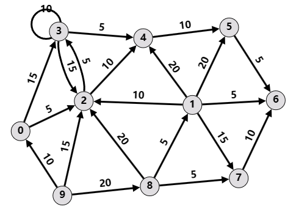

# Lab 1 Louvain实验

> **实验相关的代码和数据在`${PROJECT_ROOT}/labs/tugraph/lab1`中**

## 简介

在本实验中，你需要实现 **Louvain 社区检测算法**。本项目包含4个递进的任务：你将首先编译并运行 TuGraph-DB 提供的内置 Louvain 算法，然后在 Python 中自行实现 Louvain 算法。驱动代码和框架已经提供，你需要补全其中的关键部分。

### 数据集

给定一个 **有向引用网络**，包含 **31,136 个节点** 和 **220,325 条边**，每条有向边表示论文之间的引用关系。数据来自 5 个会议（AAAI, IJCAI, CVPR, ICCV 和 ICML），分别用 0 到 4 进行标注。你的任务是 **实现 Louvain 算法并将这些论文划分为 5 个社区**。

数据文件包括：

- `./p2_data/p2.conf`、`./p2_data/p2_vertices.csv`、`./p2_data/p2_edges.csv`：这三个文件是实际数据集，你需要将其导入为 TuGraph-DB 数据库（见任务一）。
- `test_graph.csv`：一个包含 10 个节点的小型有权有向图，用于测试你计算模块度的实现（见任务三）。
- `label_reference.csv`：包含 300 条社区标签的参考文件，在合并多余社区时可用作参考（见任务四），也可用于测试。

### 开发环境

TuGraph-DB Docker容器的设置可参考[lab0](./lab0.md)的文档。

**注意**：必须使用 Python 3.6。 默认情况下本项目不需要额外 Python 库，你可以自行添加，但禁止使用已有的社区检测 API（如 `networkx` 的相关方法）。

## 任务

### 任务一：使用 TuGraph-DB 内置 Louvain 算法

> - 相关文件：`import_data.sh`  
> - 相关 TuGraph-DB 内置算法：`louvain_embed`（需在 `/root/tugraph-db/build/` 下编译）

第一步是导入数据并运行 TuGraph 提供的内置 Louvain 算法。

1. **将提供的图数据导入为 TuGraph-DB 数据库**  
   - 数据已按 `lgraph_import` 的格式准备好，位于 `p2_data/` 目录。
   - 使用 `lgraph_import` 在 `/root/tugraph-db/build/outputs/` 下创建数据库，路径应为 `/root/tugraph-db/build/outputs/p2_db`，图名称为 `default`。
   - 我们提供了参考 Shell 脚本 `import_data.sh`。
2. **在导入的图数据库上运行内置 Louvain 算法**  
   - 编译并运行 `louvain_embed`（方法与第一阶段运行 `wpagerank_embed` 相似）。
   <!-- - **你需要截取内置 Louvain 结果的屏幕截图**并放入提交文件中。 -->

**注意**：结果可能包含超过 5 个社区（通常约 15 个）。

### 任务二：从 TuGraph-DB 读取数据

> 相关文件：`tugraph_process.py`

接下来进入 Python Louvain 算法的实现。

由于 Louvain 算法需要迭代式地合并和更新图，将整个图加载到内存中会更方便。因此，这里我们只用 TuGraph-DB **读取数据**。虽然在某些情况下，这种做法并不可行，但本项目的数据集规模允许。

1. **在 `tugraph_process.py` 中实现 `read_from_tugraph_db()` 方法**  
   - 按代码注释中的提示完成函数。
   - 需要用到 TuGraph 的 Python API。（可参考 `docs/tugraph-py-api.md` 提供的速查表）

### 任务三：计算模块度

> 相关文件：`community.py`、`louvain.py`、`test_modularity.py`

Louvain 方法需要计算节点加入/移出社区时的模块度增益。

⚠️ 本项目的图是 **有向图**，对于有向图，请使用以下公式。

$$ Q_d(i \to C) = \frac{k_{i,in}}{m} - \frac{\left( k_i^{in}\cdot\Sigma_{tot}^{out} + k_i^{out}\cdot\Sigma_{tot}^{in} \right)}{m^2} $$  

$$ Q_d(D \to i) = -Q_d(i \to D) = -\frac{k_{i,in}}{m} + \frac{\left( k_i^{in}\cdot\Sigma_{tot}^{out} + k_i^{out}\cdot\Sigma_{tot}^{in} \right)}{m^2} $$


**参数含义：**

- $k_{i,in}$：节点 $i$ 与社区 $C$ 之间的边权和（入边+出边都算）
- $m$：全图所有边权和
- $k_i^{in}, k_i^{out}$：节点 $i$ 的入度和出度
- $\Sigma_{tot}^{in}, \Sigma_{tot}^{out}$：社区 $C$ 中所有节点的入度和出度之和

你需要实现：

1. 在 `Community` 类（`community.py`）中实现 `add_node()` 和 `remove_node()` 方法
   - 每次添加/移除节点时更新 $\Sigma_{tot}^{in}$ 和 $\Sigma_{tot}^{out}$。
2. 实现 `node2comm_in_degree()` 和 `node2comm_out_degree()` 方法
   - 用于计算 $k_{i,in}$。
3. 在 `Louvain` 类（`louvain.py`）中实现 `delta_modularity()` 方法
   - 计算 $\Delta Q_d(i \to C)$。
4. （可选）添加更多单元测试到 `test_modularity.py`
   - 我们提供了基础测试用例，建议自行补充测试。

**关于单元测试的更多说明**：你可以使用 Python 内置的单元测试框架（`unittest`）来验证你所实现的模块度（modularity）计算是否正确。该单元测试使用了一个简单的带权有向图（定义在 `p2_data/test_graph.csv` 文件中）。该图如下图所示。



你可以通过以下命令执行单元测试：

``` shell
>>>> python ./test_modularity.py
..........
----------------------------------------------------------------------
Ran 10 tests in 0.001s

OK
```

如果你的函数（以及你的单元测试）实现正确，你应该能够通过所有测试，并看到类似上述的输出。注意，所提供的测试用例**可能不足以完全验证你实现的正确性**。建议（尽管不是强制要求）你在`test_modularity.py` 中添加更多的测试用例。

### 任务四：实现 Louvain 算法

> 相关文件：`louvain.py`、`p2_main.py`、`run.sh`

最后，你需要实现 Louvain 算法的主体。

1. **完成 `phase1()` 和 `phase2()` 中标记为 `TODO` 的部分**  
   - 按代码中的注释执行。
2. **完成 `merge_communities()` 方法**  
   - 最终需输出 **5 个社区**。由于 Louvain 通常会得到更多社区（例如 15 个），必须进行合并。
   - 可以利用 `label_reference.csv` 中的 300 条标签来辅助合并，也可以自行设计合并策略。

运行算法时：
- 在 `/root/tugraph-db/build/output/` 下为 `p2_main.py` 创建符号链接。
- 可使用提供的 `run.sh` 一键运行：

```sh
source run.sh
# 或 bash run.sh
```

## 参考文献

1. V. D. Blondel, J.-L. Guillaume, R. Lambiotte, and E. Lefebvre, ‘Fast unfolding of communities in large networks’, Journal of statistical mechanics: theory and experiment, vol. 2008, no. 10, p. P10008, 2008.
2. N. Dugué and A. Perez, ‘Directed Louvain: maximizing modularity in directed networks’, Université d’Orléans, 2015.
3. [Networkx Documentation: `networkx.communities.modularity()`](https://networkx.org/documentation/stable/reference/algorithms/generated/networkx.algorithms.community.quality.modularity.html).
4. [Networkx Documentation: `networkx.communities.louvain_communities()`](https://networkx.org/documentation/stable/reference/algorithms/generated/networkx.algorithms.community.louvain.louvain_communities.html).

⚠️ 虽可参考 NetworkX 文档的原理说明，但禁止在实现中直接调用上述 API。